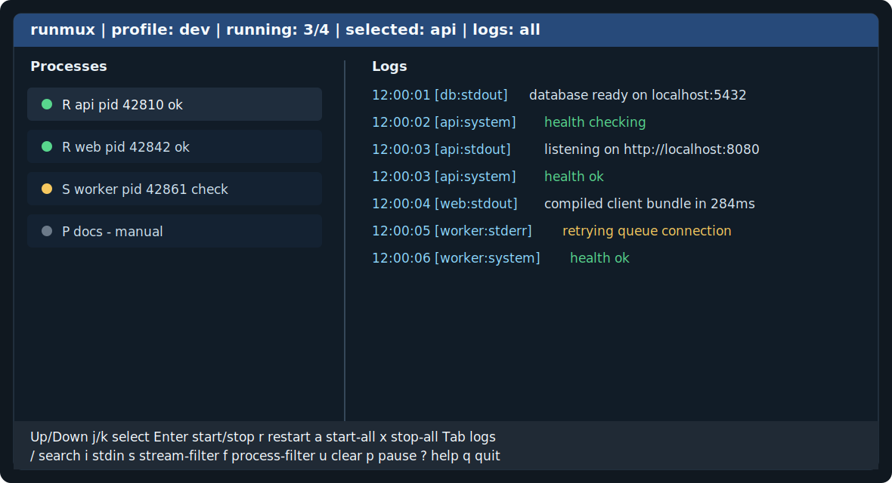

<div align="center">

<h1>runmux</h1>

A lightweight Zig TUI command runner for starting, watching, stopping, and restarting multiple development processes from one terminal.

[Key Features](#key-features) | [Usage](#usage) | [Install](#install) | [Configure](#configure) | [FAQ](#faq)

[](https://ziglang.org/)
[](https://github.com/rockorager/libvaxis)
[](src/cli.zig)
[](#configure)
[](LICENSE)

</div>

`runmux` keeps a local development stack visible and controllable without opening one terminal per service. Define processes in JSON or TOML, pick a profile, and run them through an interactive TUI or a plain log stream for CI.

---

## Key Features

### Visual Process Dashboard

Run `runmux run` for a split-pane TUI with process state on the left and live logs on the right. Start, stop, restart, filter, search, and inspect everything from one screen.



### Dependency-Aware Startup

Use `depends_on` to express process order. A dependency is ready when it is running with no health check, has passed its health check, or has exited successfully.

| Process | Rule | Result |
| --- | --- | --- |
| `db` | no dependencies | starts immediately |
| `api` | `depends_on: ["db"]` | waits for `db` readiness |
| `web` | `depends_on: ["api"]` | waits for `api` readiness |

### Health Checks and Restart Policies

Attach health checks to processes and tune restart behavior per process or through defaults.

```json
{
  "name": "api",
  "cmd": "zig build run -- serve",
  "depends_on": ["db"],
  "restart": {
    "policy": "on_failure",
    "max_restarts": 3,
    "delay_ms": 1000
  },
  "health": {
    "argv": ["/bin/sh", "-c", "curl -fsS http://localhost:8080/health"],
    "interval_ms": 1000,
    "timeout_ms": 5000,
    "retries": 30
  }
}
```

### Plain Mode for CI

Use `--plain` when a TUI is not appropriate. Logs are timestamped and prefixed with process name and stream.

```sh
runmux run --plain --config runmux.json
```

```text
12:00:01 [api:stdout] listening on :8080
12:00:02 [web:stderr] warning: rebuilt bundle
```

### Log Control

Keep bounded in-memory logs, strip unsafe escape sequences by default, filter by process or stream, search by substring, and optionally write one log file per process.

```sh
runmux run --log-dir logs
```

### JSON and TOML Configs

The default file is `runmux.json`, but files ending in `.toml` are accepted with the same schema.

```sh
runmux check --config runmux.toml
runmux list --config runmux.toml --profile dev
```

### Cross-Platform Process Cleanup

POSIX child processes run in a dedicated process group so stop and kill target the process tree. On Windows, `runmux` uses Job Objects when available, with direct-process termination as a fallback.

---

## Usage

### Quick Start

```sh
zig build
zig build run -- init
zig build run -- check
zig build run -- run
```

After installing the binary:

```sh
runmux init
runmux check
runmux run
```

### Commands

```sh
runmux run [--config runmux.json] [--profile dev] [--plain] [--log-dir logs] [--exit-on-critical-failure] [--theme dark|light|mono]
runmux check [--config runmux.json] [--profile dev]
runmux init [--config runmux.json] [--force]
runmux list [--config runmux.json] [--profile dev]
runmux --help
runmux --version
```

| Command | Purpose |
| --- | --- |
| `run` | start autostart processes and open the TUI |
| `run --plain` | run without the TUI and print prefixed logs |
| `check` | validate the selected JSON or TOML config |
| `init` | write a sample config, refusing to overwrite unless `--force` is set |
| `list` | print resolved processes, dependencies, restart policy, logs, and health checks |

### Run Options

| Option | Description |
| --- | --- |
| `--config PATH` | read a config file other than `runmux.json` |
| `--profile NAME` | select a profile from the config |
| `--plain` | use the non-interactive log runner |
| `--log-dir DIR` | write one log file per process |
| `--exit-on-critical-failure` | stop all processes when a `critical` process fails |
| `--theme dark|light|mono` | choose TUI colors |

### TUI Controls

| Key | Action |
| --- | --- |
| `Up` / `Down`, `j` / `k` | select process |
| `Enter` | start or stop selected process |
| `r` | restart selected process |
| `a` / `x` | start all or stop all |
| `Tab` | switch between selected-process logs and all logs |
| `/` | search logs by substring |
| `i` | send one line to selected process stdin |
| `s` | cycle stream filter |
| `f` | filter logs to selected process |
| `u` | clear log filters |
| `p` | pause or resume log follow |
| `?` | toggle help overlay |
| `q`, `Ctrl+C` | stop children and quit |

---

## Install

### Build from Source

`runmux` targets Zig `0.16.0`.

```sh
git clone https://github.com/ydah/runmux.git
cd runmux
zig build -Doptimize=ReleaseFast
sudo install -m 0755 zig-out/bin/runmux /usr/local/bin/runmux
```

### Development Build

```sh
zig build
zig build test
zig build run -- --help
```

---

## Configure

### Config File

Default path: `runmux.json`.

```json
{
  "version": 1,
  "default_profile": "dev",
  "defaults": {
    "cwd": ".",
    "shell": true,
    "autostart": true,
    "restart": {
      "policy": "never",
      "max_restarts": 0,
      "delay_ms": 1000
    },
    "log": {
      "max_lines": 1000,
      "strip_ansi": true
    }
  },
  "profiles": [
    {
      "name": "dev",
      "processes": [
        {
          "name": "clock",
          "cmd": "while true; do date; sleep 1; done"
        },
        {
          "name": "stderr-demo",
          "cmd": "while true; do echo warn >&2; sleep 2; done"
        },
        {
          "name": "manual",
          "cmd": "echo manual process; sleep 5",
          "depends_on": ["clock"],
          "dependency_failure": "ignore",
          "health": {
            "argv": ["/bin/sh", "-c", "exit 0"],
            "interval_ms": 1000,
            "timeout_ms": 5000,
            "retries": 3
          },
          "autostart": false
        }
      ]
    }
  ]
}
```

### Equivalent TOML

```toml
version = 1
default_profile = "dev"

[defaults]
cwd = "."
shell = true
autostart = true

[defaults.restart]
policy = "never"
max_restarts = 0
delay_ms = 1000

[defaults.log]
max_lines = 1000
strip_ansi = true

[[profiles]]
name = "dev"

[[profiles.processes]]
name = "clock"
cmd = "while true; do date; sleep 1; done"

[[profiles.processes]]
name = "manual"
cmd = "echo manual process; sleep 5"
depends_on = ["clock"]
dependency_failure = "ignore"
autostart = false

[profiles.processes.health]
argv = ["/bin/sh", "-c", "exit 0"]
interval_ms = 1000
timeout_ms = 5000
retries = 3
```

### Process Fields

| Field | Description |
| --- | --- |
| `name` | unique process name in the profile |
| `cmd` / `argv` | exactly one command form is required |
| `cwd` | working directory, defaulting to `.` |
| `env` | object of environment variables |
| `shell` | run `cmd` through the shell when true |
| `autostart` | start automatically when `run` begins |
| `depends_on` | process names that must become ready first |
| `dependency_failure` | `ignore`, `stop`, or `restart` |
| `critical` | marks a process for `--exit-on-critical-failure` |
| `restart` | `never`, `on_failure`, or `always` with limits and delay |
| `log` | `max_lines` and `strip_ansi` |
| `health` | `cmd` or `argv`, plus interval, timeout, and retries |

---

## Recipes

### Profiles

```sh
runmux run --profile dev
runmux run --profile test --plain
```

### Critical Processes

```json
{
  "name": "api",
  "cmd": "zig build run -- serve",
  "critical": true
}
```

```sh
runmux run --exit-on-critical-failure
```

### Direct Execution without Shell Parsing

```json
{
  "name": "server",
  "argv": ["zig", "build", "run", "--", "serve"],
  "shell": false
}
```

When `shell` is `false`, `cmd` must be a single executable path with no arguments. Use `argv` for direct execution with arguments.

---

## FAQ

### `runmux` cannot find my config

The default file is `runmux.json` in the current directory.

```sh
runmux run --config path/to/runmux.json
```

### A process never starts

Run `check` first, then inspect dependency readiness.

```sh
runmux check
runmux list
```

Processes with health checks are not considered ready until the health check passes.

### The TUI looks wrong

Try the mono theme or use plain mode in terminals with limited color support.

```sh
runmux run --theme mono
runmux run --plain
```

### My child process expects a real terminal

`runmux` pipes child stdout and stderr into the TUI. It is not a pseudo-terminal multiplexer, so programs that require a real TTY may behave differently.

### ANSI output is missing

ANSI escape sequences are stripped by default. Set `log.strip_ansi` to `false` to render SGR styles, 16-color, 256-color, and truecolor codes safely; unsupported escape sequences are still dropped.

---

## Limitations

- POSIX is the primary target. Windows support includes shell lookup through `COMSPEC` and Job Object cleanup when available.
- Interactive child stdin is limited to sending one line to the selected process.
- TOML support covers the `runmux` schema, but it is not a general-purpose TOML parser.
- Unicode width handling is delegated to libvaxis, but complex logs can still render imperfectly in some terminals.

---

## Project Goals

- Keep local process orchestration fast, visible, and dependency-aware.
- Provide a useful TUI without requiring tmux, panes, or a Procfile runtime.
- Keep CI and non-interactive use covered through `--plain`.
- Stay configuration-first and easy to inspect with `check` and `list`.

---

## Development

```sh
zig build
zig build test
zig build run -- check --config runmux.example.json
zig build run -- list --config runmux.example.json
zig build run -- run --config runmux.example.json
zig build run -- run --plain --config testdata/plain.runmux.json
zig build run -- run --plain --config testdata/plain.runmux.json --log-dir logs
```

## Credits

- [libvaxis](https://github.com/rockorager/libvaxis) for terminal rendering
- Zig's standard library for the build, process, JSON, and IO foundations

## License

MIT. See [LICENSE](LICENSE).
